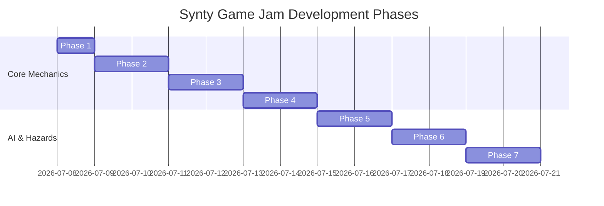

# Synty Game Jam: Hide & Seek Development Roadmap

An iterative, phase-by-phase development roadmap for our game "Micro-Migration" built in Godot 4.6.3.

---

## Phase 1: Player Controller & 2.5D Foundation (Completed)
* **Goal**: Basic player movement, environment physics, 2.5D constraints, camera setup, and automated unit testing runner.
* **Milestones**:
  * [x] Basic project configuration (`project.godot`).
  * [x] Input mapping configured for WASD and Arrow Keys.
  * [x] `player.tscn` with 2.5D locked script and tracking camera.
  * [x] `level_test.tscn` platform scene.
  * [x] Headless test runner (`run_tests.ps1` / `test_runner.gd`).

---

## Phase 2: Family Queue & Follow Behavior
* **Goal**: Establish the basic escort mechanic. Family members follow the player in a dynamic queue and react to commands.
* **Milestones**:
  * **Generic Family Member Base (`family_member.gd`)**:
    * A base script subclassing `CharacterBody3D` that supports path-following.
    * Implements a state machine (Follow, Idle/Freeze, Hiding, Alert).
  * **Queue Controller (`family_manager.gd`)**:
    * An autoload script or parent node that tracks the family list.
    * Record historical positions of the player to create a smooth, snake-like trailing queue.
  * **Command Whistle System ("Whisper Network")**:
    * `Follow` action: Commands family to follow.
    * `Freeze & Hide` action: Commands family to stop and look for immediate nearby cover.
    * *Stealth element*: Commands check proximity to the player. Whistling far away triggers a "sound circle" that can alert the Seeker.

---

## Phase 3: Family Classes & Physics Interaction
* **Goal**: Differentiate the family members to introduce tactical gameplay dilemmas and physics puzzles.
* **Milestones**:
  * **The Toddler**:
    * Runs fast.
    * Curiosity timer: If left idle/unattended, it starts wandering towards a random nearby point and chirping (generating sound cues).
  * **The Elder**:
    * Moves slowly.
    * Disable standard jump/climb capabilities.
    * Require path-helper nodes (e.g., ramps, elevators).
  * **The Adult**:
    * Normal speed.
    * Interaction class: Can push heavy crates (`RigidBody3D`) to bridge gaps or hold down pressure plates to activate elevators for the Elder.
    * "Carry" ability: Can carry Toddlers or assist Elders up small ledges.

---

## Phase 4: Cover Zones & Chain Hiding
* **Goal**: Implement the core "Chain Hiding" cover mechanic.
* **Milestones**:
  * **Cover Nodes (`cover_zone.gd`)**:
    * Create a custom `Area3D` node to designate cover.
    * Categorize zones into **Small**, **Medium**, and **Large** capacity.
  * **Assignment Logic**:
    * When "Freeze & Hide" is commanded, each family member queries local cover zones.
    * Members auto-assign themselves to matching sizes:
      * Toddler -> Small, Medium, or Large.
      * Elder/Adult -> Large only.
    * If a zone is full or too small, the character remains exposed.
  * **Flashlight Integration**:
    * Verify if characters in cover are masked from direct line-of-sight checks.

---

## Phase 5: Seeker AI & Detection System
* **Goal**: Add the looming antagonist that hunts the family.
* **Milestones**:
  * **Seeker Patrol Droid (`seeker.gd`)**:
    * Moves along path waypoints (`Path3D`/`PathFollow3D`).
    * Emits a volumetric light cone (using `SpotLight3D` + custom volumetric material/mesh).
  * **Sensor States (Stealth logic)**:
    * *Unaware*: Normal patrol path.
    * *Suspicious*: Heading towards a sound source (e.g., toddler chirp, player whistle, player throwing a decoy).
    * *Chasing*: Active pursuit of a spotted family member.
  * **Capture / Game Over**:
    * If the Seeker enters contact range of a spotted player/family member, trigger the capture sequence and Game Over state.

---

## Phase 6: UI & Audio Systems
* **Goal**: Elevate game feel and tension with a polish sweep.
* **Milestones**:
  * **Sound Design (AudioStreamPlayer3D)**:
    * Whistle / Whispering sound effects.
    * Seeker mechanical footsteps (volume/pitch based on scale).
    * Toddler chirps and giggles.
    * Ambient industrial heartbeat soundtrack that increases in intensity during close calls or chases.
  * **User Interface**:
    * Command selection overlay (Visual feedback of current command: Follow vs Freeze).
    * Toddler panic/fear warning meters floating above their heads.
    * Seeker detection indicator (yellow warning bar -> red alert eye).
    * Retro CRT/industrial style Main Menu, Pause Menu, Win Screen, and Lose Screen.

---

## Phase 7: Level Design & Game Loop Polish
* **Goal**: Build a complete, cohesive gameplay challenge suitable for jam submission.
* **Milestones**:
  * **Level Layouts**:
    * *Level 1 (Tutorial)*: Direct linear path, static cover tutorial, simple obstacle.
    * *Level 2 (The Cargo Hold)*: Introduce the Seeker patrol and toddlers wandering mechanics.
    * *Level 3 (The Engine Room)*: High verticality. Requires adults to push boxes and activate lifts to get the elders across.
  * **Game Jam Packaging**:
    * Polish victory screens and scoreboards (e.g., family members saved count).
    * Project build export test (Web/HTML5 and Windows exports).
