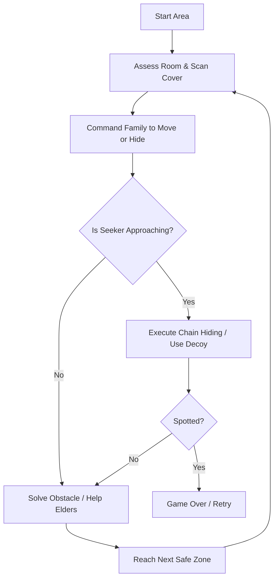

# Game Design Document (GDD): "Micro-Migration" (Working Title)

## 1. Executive Summary
* **Genre**: 2.5D Stealth / Escort / Management Side-Scroller
* **Theme**: "Hide and Seek" (Synty Game Jam 2026)
* **Target Audience**: Players who enjoy high-tension stealth, tactical coordination, and cute-but-tense atmosphere (e.g., *A Plague Tale*, *The Borrowers*, *Inside*).
* **Core Concept**: You play as the leader of a family of tiny sci-fi critters (e.g., "Rustbugs" or "Stellamice") trying to migrate across a massive, hazardous spaceship cargo bay. A giant patrol droid (the "Seeker") is scouring the area. You must direct your family members—each with unique physical limitations and behaviors—to find cascading cover ("Chain Hiding") and safely reach the exit.

---

## 2. Gameplay & Core Loop

### The Core Loop: "The Migration"
1. **Explore & Assess**: Navigate the player character forward to scout the giant environment, identifying cover spots of varying sizes (small, medium, large) and any upcoming hazards or obstacles.
2. **Command & Move**: Quietly call the family forward. Keep them close to stay stealthy.
3. **Chain Hiding**: When the Seeker patrols near, assign family members to appropriate hideouts (toddlers in small spaces like cans, elders behind large pipes, adults in floor grates).
4. **Problem Solve**: Help slow elders past ledges, activate buttons, or build makeshift ramps.
5. **Escape**: Reach the ventilation shaft / safe-haven at the end of the deck.

---

## 3. Character Classes & Behaviors

### Player / Family Leader (The Agile Scout)
* **Role**: You guide the family.
* **Abilities**: High agility, can run, jump, make noise (decoy), use vents, and whistle commands (Freeze/Hide vs. Follow).
* **Limitations**: Cannot carry heavy things alone; cannot carry the elders over large heights without tools.

### 1. The Toddlers (Fast but Unpredictable)
* **Mechanics**: Move quickly but have a "Curiosity/Fear meter."
* **Behaviors**: 
  * If left alone or in cover for too long, they may wander off to investigate shiny items or panic and make chirping noises.
  * Must be constantly scolded/herded to keep them quiet.
* **Hiding Capability**: Can fit into the tiniest hiding spots (e.g., cups, discarded soda cans, small crevices).

### 2. The Elders (Slow and Vulnerable)
* **Mechanics**: Very low movement speed. Cannot climb ledges or jump.
* **Behaviors**:
  * Entirely calm; they never panic or make noise on their own.
  * Require assistance (ramps, lifts, or being carried/assisted by Adults) to cross vertical gaps.
* **Hiding Capability**: Require large, bulky cover spots (e.g., behind massive gears, under large structural frames).

### 3. The Able-Bodied Adults (The Heavy Lifters)
* **Mechanics**: Moderate speed.
* **Behaviors**:
  * Can lift and carry toddlers, push obstacles to create ramps for elders, or stand on pressure plates to keep doors open.
* **Hiding Capability**: Cannot fit into small or medium hiding spots. Require deep recesses (e.g., floor grates, wall vents, shadow areas).

---

## 4. Key Mechanics

### Chain Hiding
* Cover is not "one size fits all." 
* A cover zone is categorized as **Small**, **Medium**, or **Large**.
* Players must hover-target or quick-assign family members to slots:
  * *Small Slots*: Toddlers only.
  * *Medium Slots*: Players and Toddlers.
  * *Large Slots*: Elders, Adults, and everyone else.
* If a character is in a slot too small for them, the Seeker's flashlight will detect their protruding parts.

### The Whisper Network (Stealth System)
* **Commands**:
  * `Follow`: Family follows the player in a snake-like line.
  * `Freeze & Hide`: Family stops in place and dives into the nearest compatible cover within a short radius.
* **Proximity Rule**: Whistling/calling commands from a distance increases the volume of the sound. If the Seeker is close, yelling will immediately alert it. Players must physically backtrack to the family to whisper commands safely.

### The Seeker (The Looming Threat)
* A massive industrial robot, vacuum droid, or human crew member.
* Patrolls with a distinct visual cone (flashlight/sensor sweep).
* Investigates unusual noises (metal clanking, toddler chirps, player decoys).
* If it fully spots any family member, it initiates a pursuit/capture state (Game Over).

---

## 5. Aesthetic & Tone
* **Visual Style**: 2.5D Side-Scroller. 3D low-poly models (using Synty assets) viewed from a side-scrolling perspective with deep parallax backgrounds showing the scale of the giant spaceship cargo bay.
* **Lighting**: Dark, industrial environment with high-contrast volumetric lights. The Seeker's searchlight should feel threatening and bright, while hiding spots are cast in cozy, warm shadows.
* **Audio**: Minimalist, tense industrial ambient sounds. Squeaks, whispers, and rustling from the family, contrasted with heavy, mechanical thuds and whirring sensors from the Seeker.

---

## 6. Technical Setup (Godot 4.6.3)
* **Viewport**: 2.5D (3D nodes with orthographic/long-focal-length perspective camera locked to a 2D plane).
* **Movement**: `CharacterBody3D` for players, using `Vector3` but locking the Z-axis (or X-axis) to restrict movement to a 2D plane.
* **Navigation**: Using Godot's `NavigationAgent3D` constrained to a 2D line/plane, or custom waypoint-following logic for the family queue.
* **State Machines**: Implemented in GDScript using clean State classes for character behaviors.
